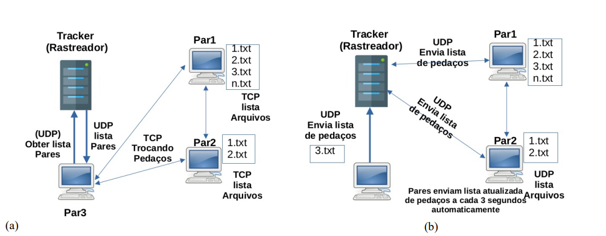

# Programa que simula o comportamento do protocolo BitTorrent

1.3.1. Os nós da rede estão participando da distribuição de um arquivo grande.

1.3.2. Um novo nó ao entrar na rede P2P deve contatar um Tracker (um servidor centralizado) e solicitar a
ele a lista de nós que fazem parte do torrent naquele momento. O Tracker entrega a lista de pares e os
pedaços que cada um tem. A conexão com o servidor é via o protocolo UDP.

1.3.3. O cliente recebe a lista (que deve conter no mínimo 3 outros pares), e deve solicitar o arquivo mais
raro primeiro a um outro par via conexão TCP. A lista deve conter o número IP de destino, porta de destino e
pedaços dos arquivos que o par tem. Após escolher o cliente com o pedaço mais raro, o sistema deve
escolher aleatoriamente um outro par da lista.

1.3.4. O cliente escolhido deve enviar o pedaço do arquivo que foi solicitado. Neste momento, a conexão
entre o cliente e o outro nó (par) é P2P.

1.3.5. A cada 3 segundos os clientes enviam automaticamente a lista de pedaços do arquivo que
disponibilizam ao Rastreador (Tracker).



Pré requisitos:
- Java 17
- Maven

Como rodar o projeto:
```bash
mvn clean install
```

Para executar um Peer
```bash
java -cp target/<NOME_DO_JAR>.jar peer.Main <TCP_PORT> <PASTA_PEDACOS>
```
Exemplo:
```bash
java -cp target/Sockets_PeerToPeer_Torrent-1.0-SNAPSHOT.jar peer.Main 5001 pieces
```

Para verificar as conexões ativas, utilize o comando:
```bash
netstat -tunp
```